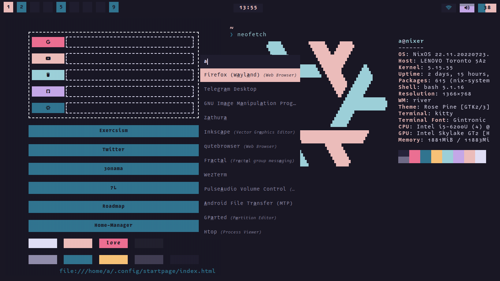
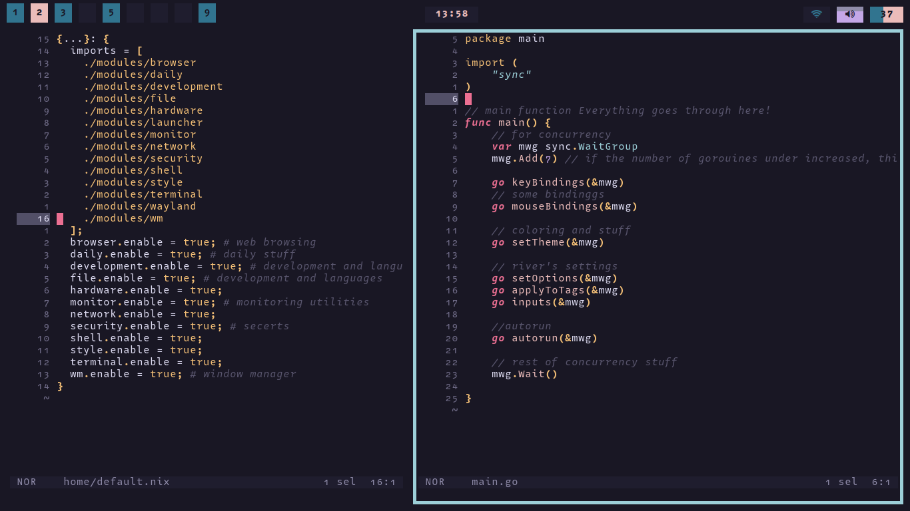
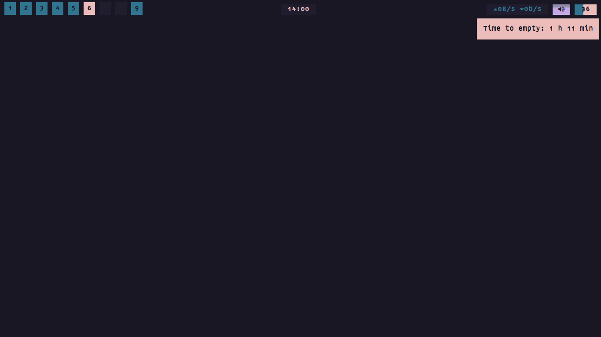

# DoFi
Do(t) Fi(les) is the repo where I keep my NixOS configurations.

[](https://twitter.com/amirography)


## Screenshots






## Fetch
- OS: **Nixos**
- Window Manager: **River** (dotfiles in Go in [another repo](https://github.com/amirography/river-dotfiles).)
- Bar: **Waybar**
- Launcher: **Rofi**
- Notification: **Mako**
- Screenshot: **Grim**
- Browser: **Qutebrowser** (and Firefox for fallback)
- Editor: **Helix** (and Neovim for fallback)
- Terminal: **Kitty** (and Wezterm for fallback) 
- Colorscheme: **Rose Pine**
- Font: **Gintronic** (nerd fontified)
- Shell: **Bash** (for underlying system and user) and **Fish** (for interactive use).

## Project Structure
```bash
  DoFi
├──  home # all the modules that are installed at user level
│  └──  modules 
│     ├──  browser
│     │  ├──  chromium
│     │  ├──  firefox
│     │  ├──  qutebrowser
│     │  └──  startpage
│     ├──  daily
│     ├──  development
│     │  ├──  build
│     │  ├──  c
│     │  ├──  css
│     │  ├──  git
│     │  ├──  go
│     │  ├──  helix
│     │  ├──  json
│     │  ├──  neovim
│     │  ├──  nixdev
│     │  ├──  rust
│     │  └──  zig
│     ├──  file
│     │  └──  lf
│     ├──  hardware
│     ├──  launcher
│     │  └──  rofi
│     ├──  monitor
│     ├──  network
│     ├──  security
│     ├──  shell
│     │  ├──  bash
│     │  ├──  fish
│     │  ├──  nu
│     │  └──  zsh
│     ├──  style
│     ├──  terminal
│     │  ├──  kitty
│     │  ├──  tmux
│     │  ├──  wezterm
│     │  └──  zellij
│     ├──  wayland
│     └──  wm
│        ├──  mako
│        ├──  river
│        └──  waybar
├──  secrets # secret files that are non-of-your-business
├──  style # system level variables that are used for styling
└──  system # system level installation
   ├──  boot
   ├──  docker
   ├──  fonts
   ├──  graphical
   ├──  hardware
   ├──  locale
   ├──  network
   ├──  nix
   ├──  shell
   └──  users
```
## Authors

- [@amirography](https://www.github.com/amirography)

